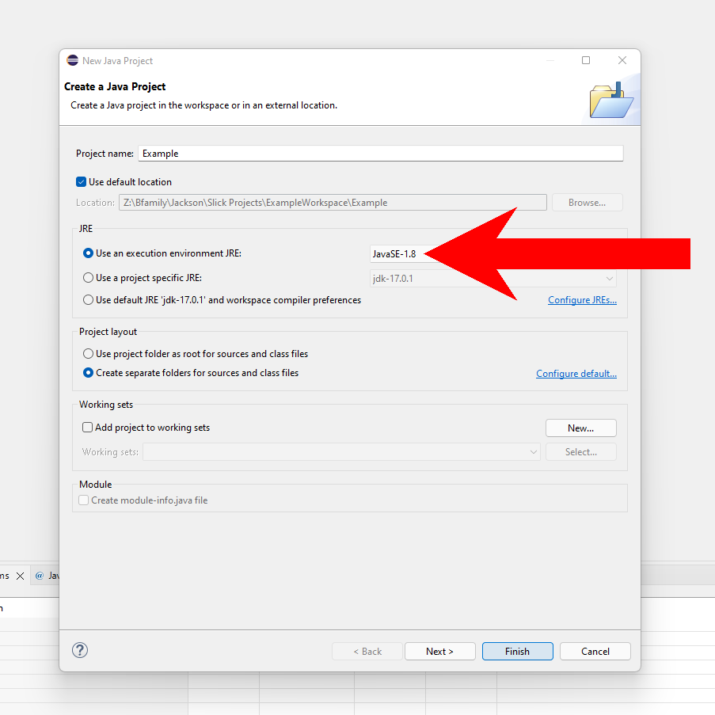
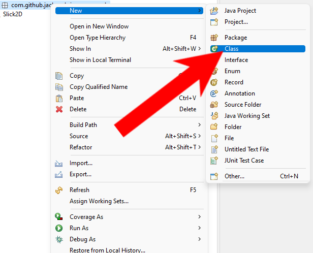
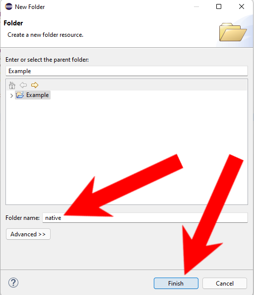

<head>
    
</head>
<body>
    
    

        <a href="#description" style="text-decoration: none;">
Description
</a>
        <a href="#setup" style="text-decoration: none;">
First Time Setup
</a>
        <a href="#individual-downloads" style="text-decoration: none;">
Individual Downloads
</a>
    

    

        <h1>Slick2D Tutorial</h1>
        
Simple Slick2D Tutorials in Eclipse  
        Small note: These tutorials are for beginner-level programmers and game developers that have an entry-level understanding of object-oriented programming in java. Slick2D has been out of development for around 9 years, if you are looking for professional-level game development in java I would highly recommend <a href="https://www.lwjgl.org/" target="_blank">LWJGL</a> or <a href="https://libgdx.com/" target="_blank">LibGDX</a>.  
        <a href="https://slick.ninjacave.com/" target="_blank">Slick2D Download Link</a>

    

    

        <h1>Setting up your First Project</h1>
        <ol>
            <li>Let's start from a blank Eclipse project, I am using update 2021-12 but these steps should work with all modern versions of eclipse. Let's start by creating a new project, we can simply hit the create new project button.</li>
            
            <li>I will name my project "Example" but you can name your project however you wish. One small note, since Slick2D is a bit dated we need to ensure that we are running it in Java 1.8, for most of you you should have to worry about this, but if you have another one selected make sure to change it to 1.8</li>
            
            <li>Next, we will need to import the Slick2D Framework, to start let's download it, you can <a href="https://slick.ninjacave.com/slick.zip">Click This</a> to download the zipped Slick2D folder. Now we will need to unzip the folder, you can do this by simply navigating to the file in your downloads folder(or wherever you downloaded it) right-clicking on the slick.zip file, and selecting "Extract All..."</li>
            
            <li>Then a window will open up prompting you to extract the zip, click the "Extract" button.</li>
            
            <li>After doing this, navigate back to eclipse and right-click on your project, hover over "Build Path", then select "Configure Build Path".</li>
            
            <li>A new window will pop up, on the right side of this window click "Add Library"</li>
            
            <li>Another window will appear, on the middle section of this window select "User Library", then click "Next"</li>
            
            <li>Now select "User Libraries..."</li>
            
            <li>Now select "New"</li>
            
            <li>To explain what we are doing, we are going to create a User Library that holds all the files that we need for Slick2D, this will make it easier to import into new projects that we make in the future. Now we need to enter the Libraries name, enter "Slick2D" into the text field, then press "OK"</li>
            
            <li>Now click on "Add External JARs..."</li>
            
            <li>Now navigate to your slick unzipped folder, and once in the folder enter the "lib" folder. Once inside the lib folder select everything in the folder, then press "Open"</li>
            
            <li>Now scroll through the imported JARs and find the one titled "slick.jar" and make sure the drop-down arrow is clicked, in this drop-down menu double click on the section titled "Javadoc location: (None)"</li>
            
            <li>A new window will pop up, select "Browse..."</li>
            
            <li>Navigate to your slick folder again, and select the folder "javadoc", then click the "Select" button.</li>
            
            <li>Click Apply and Close</li>
            
            <li>Click "Finish" and then click "Apply and Close"</li>
            
            <li>For our projects, we will use Packages to organize our code. Right-click on your "src" folder hover over "new" and then click on "Package"</li>
            
            <li>Here I use standard Package naming conventions, but you can use any naming you wish. Packages are very similar to directories, instead of using a <b>/</b> or <b>\</b> we use a <b>.</b> to separate different "packages" or folders. For what we are doing here you could simply use your project name as your root package, so for me, it would be "example", or if you were making a pong game your root package could simply be "pong". But for now, pick whatever name you would like, then click "Finish"</li>
            
            <li>Now right click on our root package that we just created, hover over "new", then click "Class"</li>
            
            <li>Now will create our main Game class, we will title this class a very fitting name of "Game", then click "Finish"</li>
            
            <li>Lets also create one more Class</li>
            
            <li>Lets also create one more Class</li>
            
            <li>This one we will title "Launcher", we also want to check to include a main method, this is where we will Launch our game from, finally, click "Finish"</li>
            
            <li>We are almost to writing code but before we get there we need to import one more piece from Slick2D, to do this we need to start by creating a new directory, right-click on your project, hover over new, and select "Folder"</li>
            
            <li>Name the Folder "native", the naming is very important! Then click "Finish"</li>
            
            <li>Now we get to write our code, we won't go too in-depth, that's for later, but we will write a very simple game class. Notice how we extend BasicGame, this is needed for us to get and use the methods init, render, and update. Along with that we also get the constructor, this constructor gets an argument of a String which will be the title of our window.</li>
            
            <li>Next, we need our launcher for our game, in here we need to do a few things. Notice the first three lines, the first line is getting a String that is the path to our "native" folder, the next two lines load those libraries which are needed for Slick2D to function properly. Next, we make an AppGameContainer, notice the 4 arguments, the first one is our Game, the next two are the width and height of our game, the last one is if we want our game fullscreen or not, in this case, we put false so that it is windowed. Finally we "start" our display, this creates our window and calls our games init method.</li>
            
            <li>Finally, we run our program, and we get to see our window. If you followed everything properly you should get a display like this. If you are having problems, you can refer to the project directory under the name "Example".</li>
            
        </ol>
    

    

        <h1>Individual File Downloads</h1>
        <ul>
            <li><a href="https://kinolien.github.io/gitzip/?download=/JacksonBrienen/Slick2DTutorial/tree/main/Example/" target="_self">Example</a></li>
        </ul>
    

</body>